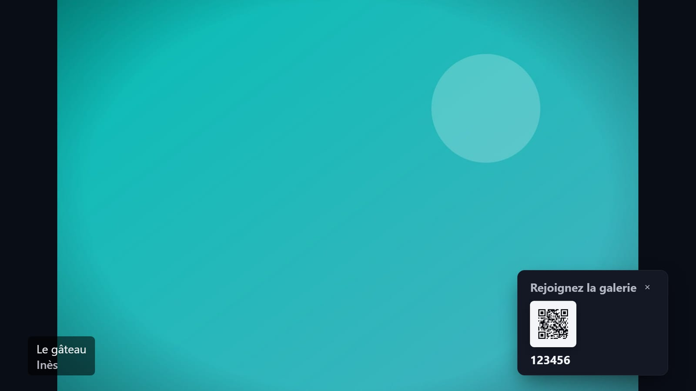
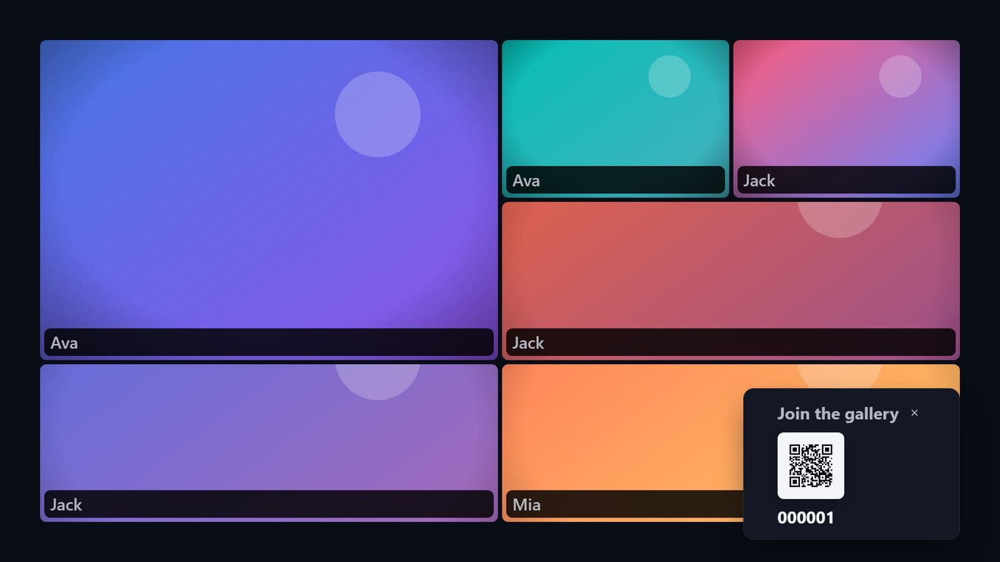
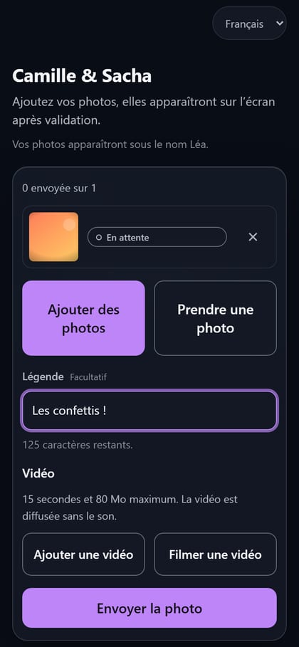
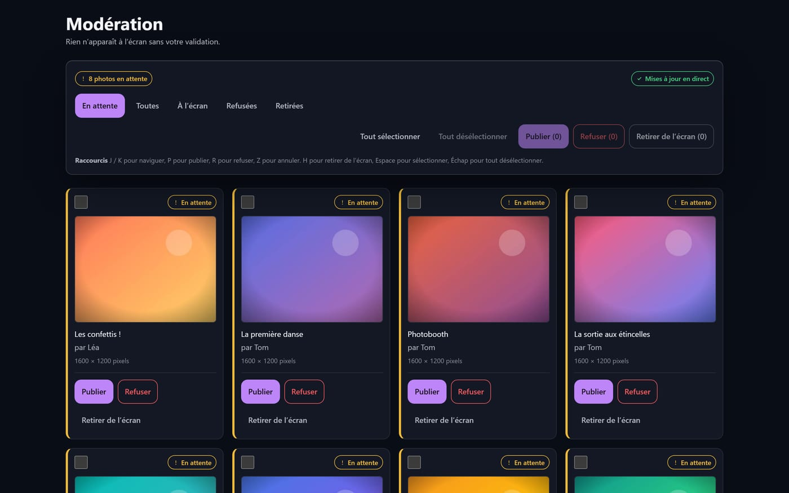
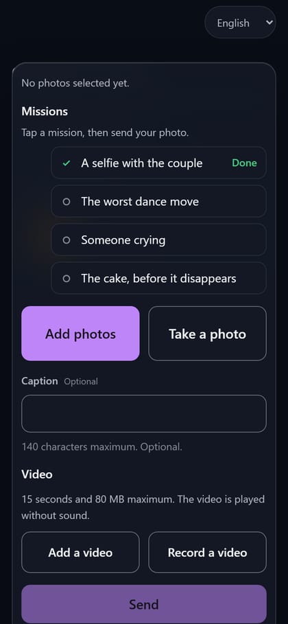
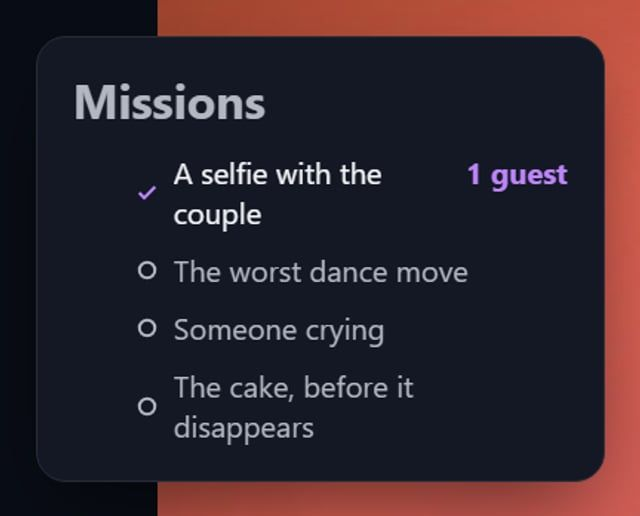
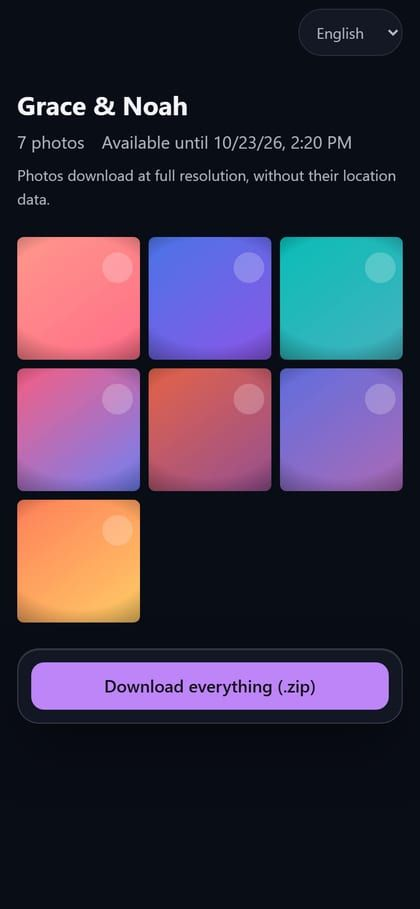
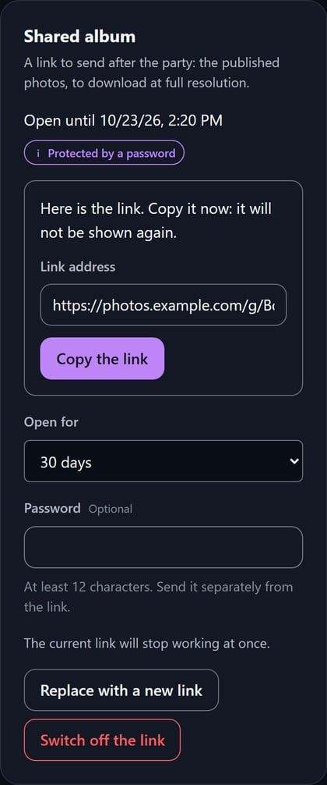

# EventSlide

**A live photo wall for your event.** Guests scan a QR code, send photos from their
phone with no account and no app, you approve them, and they appear on the projector
within seconds.

Self-hosted. The photos stay on your machine.

<p align="center">
  
  
</p>
<p align="center">
  
  
  
</p>

---

## Why

Every event photo-sharing tool asks one of two things: that your guests install an app,
or that you hand a few hundred family photographs to a company you have never heard of.

EventSlide asks for neither. It runs on one machine — a laptop, a mini PC, a Raspberry
Pi under the projector — and nothing leaves it.

## What it does

- **Guests join by scanning.** A QR code, a six-character code, a first name if they
  feel like it. No account, no download, no email.
- **Nothing reaches the screen without you.** Every photo waits in a moderation queue
  until you approve it. Two hundred people are watching that screen; that is not a
  setting to leave to chance.
- **The wall is meant to be looked at.** Full-bleed photos with a slow zoom or one of
  five other layouts, captions and the sender's name, a join code in the corner for
  whoever arrives late.
- **It survives the venue.** Uploads retry, the wall keeps playing when the network
  drops, and it runs unattended for an eight-hour evening.
- **Privacy is handled, not mentioned.** Location data and device identifiers are
  stripped from every photo on arrival — a guest's camera records the coordinates of
  wherever they are standing, and that is often somebody's home.
- **Guests are told what happens to their photos, before the first one.** Who sees it,
  whether you check it before the screen, how long it is kept and how to have it removed
  — written from your event's own settings, in the guest's language, so it cannot say
  something your configuration does not do. Read once per phone, and shown again if you
  change one of those settings mid-evening.
- **The album is yours afterwards.** One ZIP, full resolution, and an automatic purge
  when you choose one.
- **And your guests', with one link.** The morning after, make a shared gallery link on
  the event page and send it to everybody: the photographs that were on the wall, in full
  resolution and without their location data, to download one by one or as a ZIP. It
  expires when you say (a month unless you choose otherwise), it can ask for a password,
  and you can switch it off at any moment — every photo it ever showed stops loading at
  once.

And the parts that only show up on the night:

- **Photo missions give guests something to do.** You write a short list of prompts — "a
  selfie with the couple", "the worst dance move", "someone crying" — and guests see them
  as a checklist. It changes the question in their head from "should I bother uploading
  this" to "which one is left".
- **Short video clips too**, not only photographs. Fifteen seconds, transcoded on the
  box, played on the wall without sound — because a room already has music.
- **Moderate from your phone.** One photograph at a time, swipe right to publish, left
  to refuse. The person deciding is usually standing up with a drink, not sitting at a
  laptop.
- **The upload survives the venue Wi-Fi.** A photo picked with no signal is queued on
  the phone and sent when there is some, even if the guest has closed the page —
  EventSlide installs as an app if they let it, and keeps working when the network does
  not.
- **It speaks everybody's language, not only the guest's.** French, English, Spanish,
  German and Italian, across the whole interface: the guest's phone, the moderation
  console, the admin pages and the projected wall. International weddings are the normal
  case, and so is a moderator who is not the person who installed the box.

  A guest and a host each pick their own from a control in the header, and it is
  remembered. The wall is the exception and it is the interesting one: there is nobody in
  front of a projector to ask, so its language is a setting on the **event**, chosen by
  whoever created it and defaulted to the language they were reading at the time.

  What is never translated is what people write. An event's name, a caption, a guest's
  display name and a mission prompt are shown exactly as typed — so a German wall over a
  French wedding prints German labels above French prompts, which is the right way round.
  A native reader has not yet gone over the German, Spanish and Italian copy on the host
  and wall surfaces; the French is hand-written and is the source the rest is translated
  from.

- **It looks like the evening it is running.** The host picks an accent colour, a font
  pairing and a frame style; the wall wears all three, and the guests' phones the colour.
  The colour is checked against the accessibility contract server-side, so one that
  would leave the text on it unreadable at ten metres, or could be mistaken for a warning
  or an error, is refused rather than rendered.
- **Translucent surfaces that give way before the wall does.** The guest's upload screen
  uses a glass material over the photographs, and it is measured: a phone that stops
  answering a tap promptly gives up the blur. The projected wall never wears it — its
  photographs never stop moving, which is exactly what makes a blur expensive — and if
  the machine driving the projector cannot hold its frame rate, it gives up the slow zoom
  before the crossfade. A host who prefers the plainer surface turns the glass off per
  event.

## Install

You need Docker, and an https address your guests' phones can reach. The commands come
first; what the https part asks of you is explained after them.

```bash
git clone https://github.com/Irony42/EventSlide.git
cd EventSlide

# Two secrets, and the address your guests' phones will reach.
node -e "console.log('SESSION_SECRET='+require('crypto').randomBytes(48).toString('base64url'))" >> .env
node -e "console.log('GUEST_TOKEN_SECRET='+require('crypto').randomBytes(48).toString('base64url'))" >> .env
echo "PUBLIC_URL=https://photos.example.com" >> .env
# Your own account, created on the first boot.
echo "BOOTSTRAP_OWNER_EMAIL=you@example.com" >> .env
echo "BOOTSTRAP_OWNER_PASSWORD=choose-a-long-passphrase" >> .env

docker compose up            # the first time, and read what it says
docker compose up -d         # once it has booted cleanly
```

Then open `PUBLIC_URL/login` and sign in with that email and password. The first sign-in
asks you to choose a new password before it shows you anything else.

**Run it in the foreground the first time.** A missing or malformed variable makes the
server print every problem at once and exit rather than start — which is what you want,
and what you will not see if the first run is detached, because the container restarts
on its own and the list scrolls away. Once it boots, `-d` is the right way to leave it.

**The two `BOOTSTRAP_OWNER_` lines are how the first account is made.** There is no
default admin and no setup page: the server creates that owner on its first boot, against
an empty database, and does nothing with the two lines after that — once you have signed
in and chosen your own password, you can delete them. Set both or neither. The password
is held to the same rule as every account's, at least 12 characters and not an obvious
one, and a weak one is refused at boot like any other bad variable.

**`PUBLIC_URL` must be an https address a phone on the venue Wi-Fi can actually reach**,
never `localhost`. It is what the QR code encodes, and a QR code pointing at `localhost`
is the most common way a setup fails on the night. Test it by scanning your own QR code
from your phone before the guests arrive.

**https is not optional, and this is the one part of the install that is not one
command.** EventSlide speaks plain HTTP and never terminates TLS itself, so something in
front of it does — Caddy, nginx or Traefik, whichever you already run. The reason is not
ceremony: a host's login cookie is marked `Secure`, so a browser will not send it back
over plain http, and a server that let you configure that would hand you a login form
that never logs in. Rather than fail there, it refuses at boot and says so. `compose.yaml`
binds the port to `127.0.0.1` for the proxy to reach and sets `TRUST_PROXY_HOPS=1` to
match; if your proxy is a container on the same Docker network, delete the `ports:` block
and point it at `eventslide:4300`.

With Caddy, the whole proxy is one line in a `Caddyfile` next to the compose file:

```
photos.example.com {
  reverse_proxy 127.0.0.1:4300
}
```

**A venue with no domain name is the case this does not cover.** A box on a LAN with no
DNS and no certificate cannot serve https that a guest's phone will trust, and EventSlide
will not run over plain http in production. Today the answer is a real domain pointed at
the machine — which works over the venue's Wi-Fi as long as the phones have any route to
it — or a `--network host` proxy with a certificate you already own. If you need a purely
offline wall, say so on the issue tracker; the constraint is deliberate but it is not
free, and it is written down as an open question rather than as a solved problem.

<details>
<summary>Without Docker</summary>

Node 24 or later.

```bash
npm install

# The same secrets, address and first owner as the Docker install above. `npm start`
# reads this `.env` if it is there; it never overrides a variable your shell or your
# service manager already set, so a systemd unit can own them instead.
node -e "console.log('SESSION_SECRET='+require('crypto').randomBytes(48).toString('base64url'))" >> .env
node -e "console.log('GUEST_TOKEN_SECRET='+require('crypto').randomBytes(48).toString('base64url'))" >> .env
echo "PUBLIC_URL=https://photos.example.com" >> .env
echo "BOOTSTRAP_OWNER_EMAIL=you@example.com" >> .env
echo "BOOTSTRAP_OWNER_PASSWORD=choose-a-long-passphrase" >> .env
# The one line `compose.yaml` writes for you: there is one proxy in front of the server.
echo "TRUST_PROXY_HOPS=1" >> .env

npm run db:migrate
npm run build
npm start
```

**`TRUST_PROXY_HOPS=1` is what makes the login work behind your https proxy.** Without it
the server does not take the proxy's word that the request arrived over https, so it
never sends the `Secure` login cookie: the sign-in form accepts your password and you are
still signed out. It also means the server believes the address the proxy forwards, and
`npm start` listens on port 4300 on every interface — so firewall that port and let only
the proxy reach it, or anybody on the network can claim an address of their choosing and
walk past the per-address rate limits.

**There is no weak default to fall back on, and that is deliberate.** `NODE_ENV` is
`production` unless something says otherwise, so a server started without those two
secrets prints both and exits instead of signing cookies with something it made up.
`.env.example` walks through most of the others — upload limits, quotas, video clips,
the two sweeps, the shared gallery's rate limits — and is worth reading; copying it
verbatim stops the boot, because the secrets in it are placeholders and the server knows
them by sight.

To look around before there is a real event, give the demo a scratch database and run
the development server on it. `npm run db:seed:demo` refuses a database that already
holds an account, which yours does from its first boot:

```bash
export DATABASE_PATH=./demo/eventslide.sqlite MEDIA_ROOT=./demo/media
npm run db:seed:demo   # an event with six photos on the wall and two awaiting moderation
npm run dev            # then sign in at http://localhost:5173/login as the seed says
```

</details>

## Photo missions




The cheapest way to get more photographs is to stop asking guests to decide what is worth
sending. Write four or five prompts on the event page and they become a checklist on every
guest's phone.

A guest taps a prompt before sending, which is one tap and no extra screen. The wall shows
the list with what has been answered so far, in a corner, standing still — it is a
scoreboard for the room, not a thing that flashes every time somebody uploads.

Two details that matter more than they look:

- **A mission is answered when a _published_ photograph names it**, not when a guest tags
  one. So a photograph you refuse in moderation never counted, and nothing has to be
  un-counted. The same holds for one a guest deletes, or one a retention sweep purges.
- **A prompt can be per guest or once for the evening.** "A selfie with the couple" is
  something everybody can do; "the first dance" happens once. You choose per prompt, and
  the default is per guest.

Prompts are content, not interface: you write them in the language of your evening and
they are shown exactly as typed. There is no leaderboard and no per-guest score — a guest
sees their own checklist and nothing about anybody else's.

<br clear="right">

## Shared gallery




The morning after, the same question arrives from everybody, one at a time: can you send
me the photos. The **Shared album** panel on the event page answers it with one link.

Choose how long it stays open — 7, 30 or 90 days — and, if you want one, a password of at
least 12 characters to send separately. The address is shown once, when you make it: the
server keeps only a fingerprint of it, so copy it then. Making a new link switches the
old one off, and so does **Switch off the link**. Only the event's owners see the panel;
a moderator can publish to the wall, not to the internet.

Whoever opens the link needs no account. They type the password if there is one and get
the album as a grid; each photograph opens larger with **Download the original**, and
**Download everything (.zip)** takes the lot.

What the link hands out, and what it does not:

- **Full resolution, without location data.** The originals as the box stored them, which
  means already stripped of coordinates and device details on arrival. A video comes as
  the box transcoded it, not as the phone filmed it.
- **Only what was on the wall.** Pending, refused and hidden photographs are not in it,
  and one you take off the wall after sending the link is gone from it at the next page
  load.
- **Switching it off is immediate.** Nothing more loads from it, in a tab already open
  either, and a ZIP halfway through downloading is cut off rather than finished — so
  nobody is left holding an archive that looks complete and is not.

<br clear="right">

## On the night

1. **Create the event** in `/admin` — a name is enough.
   Add photo missions here too, if you want them.
2. **Print the QR code** from the event page and put it on the tables.
3. **Open it to guests** from the event page when the evening starts, or give it an
   opening time in its settings. Until then it is a draft: the QR code lets nobody in
   and there is no wall to show.
4. **Open the wall** on the projector: the display page, fullscreen. It needs no
   keyboard after that.
5. **Keep the moderation queue open** on your laptop or phone. New photos arrive by
   themselves; `J`/`K` to move, `P` to publish, `R` to refuse, `Z` to undo.
6. **The morning after**, make the [shared gallery](#shared-gallery) link on the event
   page and send it to your guests. Your own copy of the album, with the photos you took
   off the wall, is **Download the album** on the same page.

Three settings worth a thought before you start:

- **Moderation.** Approving every photo yourself is the default, and the right choice for
  anything with colleagues or extended family in the room. Publishing automatically is
  for a small party among close friends, and the app will warn you when you choose it.
- **Retention.** Nothing is deleted unless you ask — and your guests are told so. If you
  set a retention period, the album is purged that many days after the event closes —
  export it first. The server
  checks every hour and deletes what is due, so the promise the setting makes to your
  guests is kept without you remembering. `npm run purge:dry-run` lists what the next
  sweep would remove, `npm run purge` does it now, and
  `RETENTION_SWEEP_INTERVAL_MINUTES=off` hands the schedule to your own cron.
- **Opening and closing on their own.** The settings page takes an opening time and a
  closing time; leave either empty and you do that one yourself. The times are read on
  your own computer's clock, so 18:00 means 18:00 where the party is. If the server was
  off at 18:00 the event still opens at the next check — a missed window is honoured,
  not skipped — and closing an event stops uploads without deleting anything. A time you
  have already passed is refused when you set it, so check the date before you save "close
  at 02:00" at half past nine. `SCHEDULE_SWEEP_INTERVAL_MINUTES=off` stops the server
  applying schedules; it does not stop you setting them, so they pile up while it is off
  and the first check after you turn it back on applies them all at once — clear them
  first if any event has one.

## Backups

Take one before the event and one the morning after. It is two commands, the server can
stay up, and the second one is the half that matters.

```bash
npm run backup                           # -> ./backups/eventslide-<timestamp>/
npm run backup -- --to /mnt/usb/mariage  # or somewhere that is not this machine

npm run restore -- <archive> --dry-run   # rehearse: verify, print the plan, write nothing
npm run restore -- <archive> --force     # --force is required to overwrite anything
```

The archive is a directory holding a consistent snapshot of the database, every photo,
and a manifest of counts and checksums. `backup` re-reads everything it just wrote before
it says OK, so an archive that exits 0 is one you have a reason to trust;
`npm run backup:verify -- <archive>` re-checks an older one. `restore` verifies the whole
archive before it touches anything and refuses to overwrite an installation that is still
there unless you say `--force`, which tells you exactly what it is about to destroy.

Copy the archive somewhere else, and keep your `.env` with it — the secrets are not in
the archive, and restoring photos with new ones signs every host out. Details, and what
the checks do and do not catch, are in
[docs/SECURITY.md §11](docs/SECURITY.md#11-deployment-posture).

## For contributors

The interesting parts are documented rather than left to be inferred:

|                                                |                                                                                      |
| ---------------------------------------------- | ------------------------------------------------------------------------------------ |
| [CLAUDE.md](CLAUDE.md)                         | The rules, the layer boundaries, and the traps this codebase has already fallen into |
| [AGENTS.md](AGENTS.md)                         | The same, for any AI coding agent                                                    |
| [docs/ARCHITECTURE.md](docs/ARCHITECTURE.md)   | Layers, a guest upload traced file by file, the ports, the schema                    |
| [docs/TESTING.md](docs/TESTING.md)             | Six test rings and which one a given test belongs in                                 |
| [docs/SECURITY.md](docs/SECURITY.md)           | The threat model, written around who is actually in the room                         |
| [docs/DESIGN-SYSTEM.md](docs/DESIGN-SYSTEM.md) | Tokens, primitives, and the accessibility contract                                   |
| [docs/API.md](docs/API.md)                     | The HTTP contract                                                                    |
| [docs/ROADMAP.md](docs/ROADMAP.md)             | What comes next, and what will never be built                                        |
| [docs/adr/](docs/adr/)                         | Why the architecture is the way it is, including the alternatives that lost          |

```bash
npm run dev            # API on :4300, web on :5173
npm run verify         # lint + typecheck + coverage + build — the gate
npm run verify:full    # the above plus the Playwright journeys
```

`npm run lint` enforces the architecture, not just code style: a file in
`src/domain` that imports Express fails the build. `src/domain` and
`src/application` are held at 100% branch coverage.

## Licence

GNU General Public License v3.0. The full text is in [LICENSE](LICENSE), and
`package.json` declares the same `GPL-3.0`, so the declaration and the grant now agree —
for a self-hosted product whose whole argument is that the operator owns their own
machine and their guests' photos, that is not administrative tidying.

In short: run it, read it, change it, and pass it on — and if you distribute a modified
version, ship the source under the same licence.
